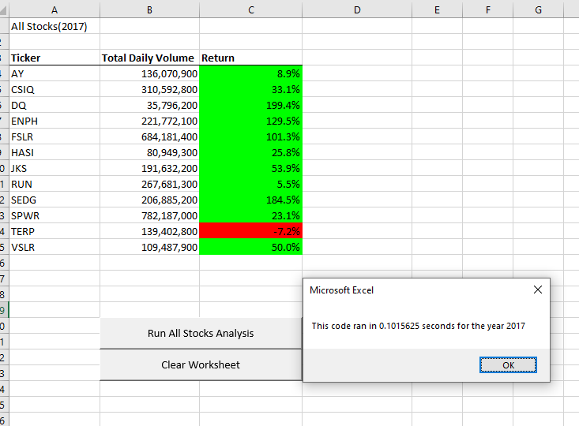

# Stock-analysis

## Overview of Project

### In this project, we worked for Steve to analyse tickers to figure out which stocks are worth investing for his parents.
 

 

## Results
###  Analysis of 2017 stocks plus benchmark. 

 

### Analysis of 2018 stocks plus benchmark. 

 

## Stocks analysis and benchmark analysis. 

In regards of the stock analysis, we can tell 2017 was a better year to invest in comparaison of 2018. 
At a glance we analyse that ticker ENPH was a good investment for both years. RUN ticker was also good investment in regards of the depreciation of stocks market in 2018. In an other hand ticker TERP was not worth investing at all. 
 
We benchmarched our code for both year before an after refactoring and we can analyse that the refactored code is ~80% faster.

## Summary

Refactoring code made it run faster, but coming at the cost of complexity. 
The cons is that refactoring imply a more complicated code and can be more difficult to handle but he does run ~80% faster. So the script can handle more data. 
We also figure out that when we activate a different worksheet in a place we don't need it's made the code lose speed consequently, at contrario of activate it in key spot win speed.

